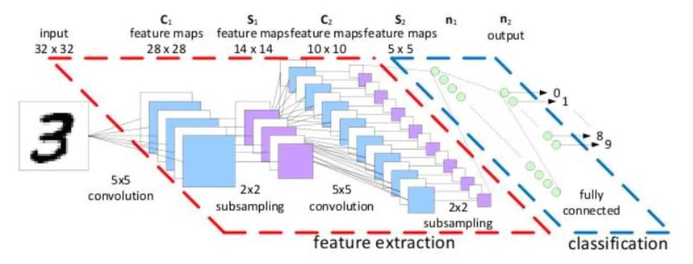
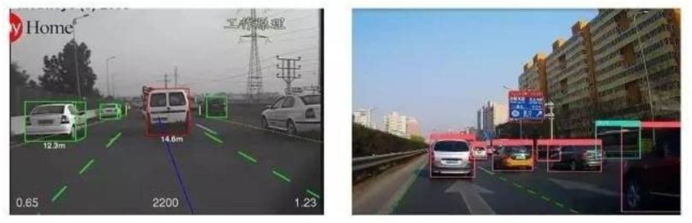
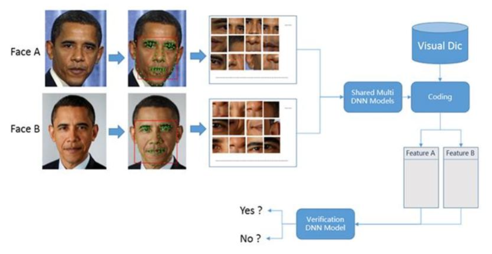
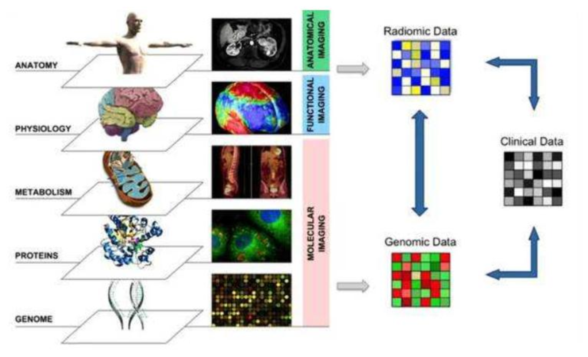
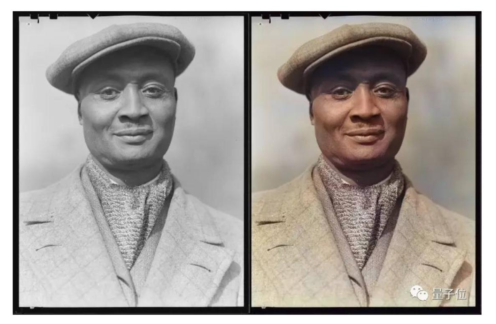
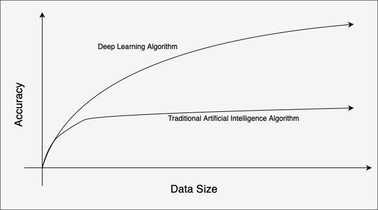
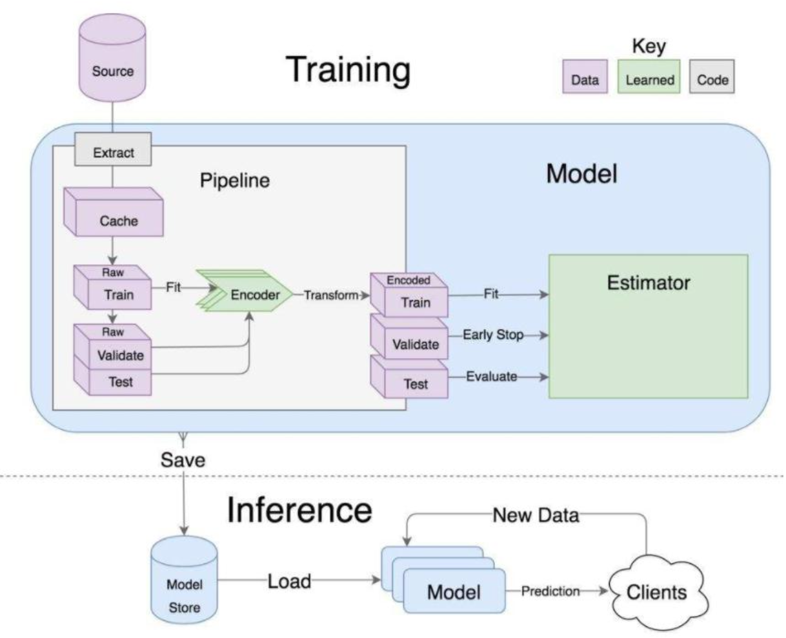
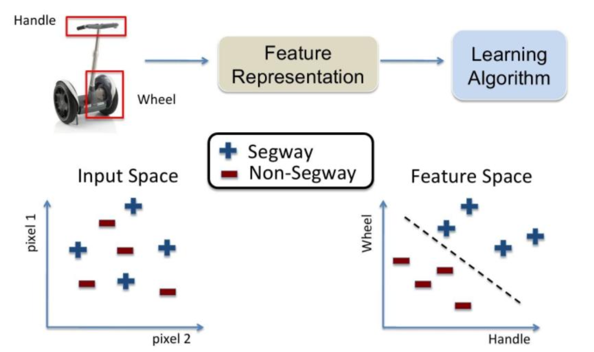
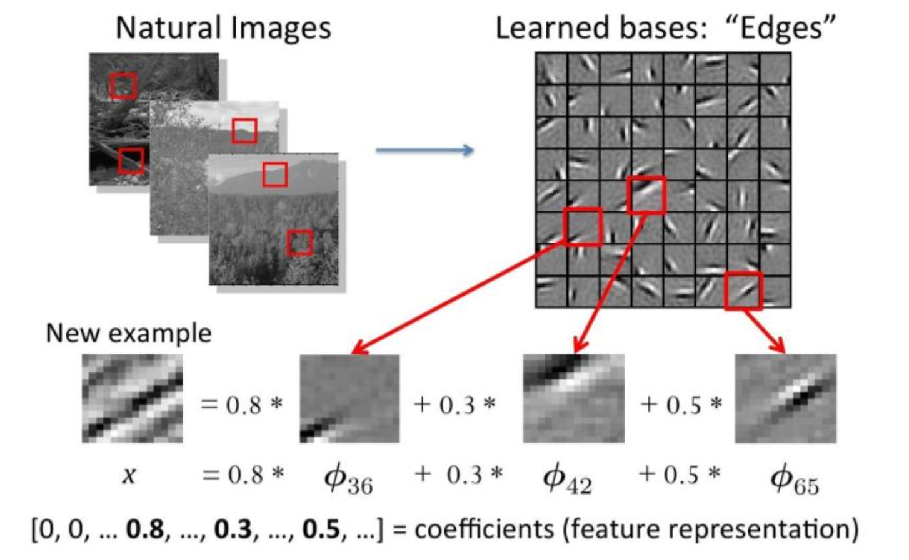

# Introduction

## Why Need Deep Learning

### Applications of Deep Learning

### Traditional Artificial Intelligence Algorithm v.s Deep Learning Algorithm

## Procedures

### 1. Data Collection

### 2. Feature Engineering

- Data features determine the upper bound of the model
- Preprocessing and features extraction are the core
- Algorithm and parameter selection determine how to approach this upper limit

#### Methodology of Features Extraction

Traditional features

### 3. Build Model

### 4. Evaluation and Application
