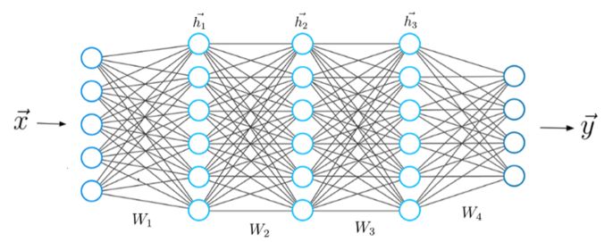

# Artificial Intelligence Introduction

**\*Deep Learning $\subseteq$ Machine Learning $\subseteq$ Artificial Intelligence**

**\*Artificial Intelligence $\simeq$ Program Function**

Function: INPUT -> PROCESS -> OUTPUT

$$f(x)=y$$

> $f$ = model \
> $x$ = input data \
> $y$ = prediction

## Artificial Intelligence

Artificial Intelligence describes when a machine mimics cognitive functions that humans associate with other human
minds.

## Machine Learning

Machine learning is a series of algorithms that analyze data, learn from it, and make informed decisions.

## Deep Learning

Deep learning is a young subfield of artificial intelligence based on artificial neural networks.

**Deep Learning $\cong$ Neural Network**

## Machine Learning v.s Deep Learning

| Comparison           | Machine Learning                                      | Deep Learning                                           |
|----------------------|-------------------------------------------------------|---------------------------------------------------------|
| Datasets Requirement | Can train on smaller data sets                        | Requires large amounts of data                          |
| Feature Extraction   | Requires more human intervention to correct and learn | Learns on its own from the environment and past mistake |
| Training Duration    | Shorter training duration                             | Longer training duration                                |
| Accuracy             | Lower accuracy                                        | Higher accuracy                                         |
| Correlation          | Make simple, linear correlations                      | Makes non-linear, complex correlations                  |
| Hardware Requirement | Can train on a CPU                                    | Needs a specialized GPU to train                        |
