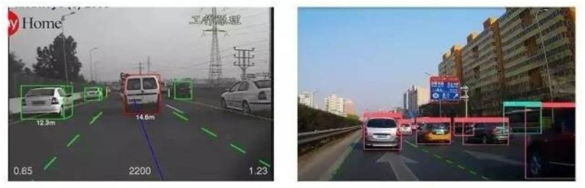
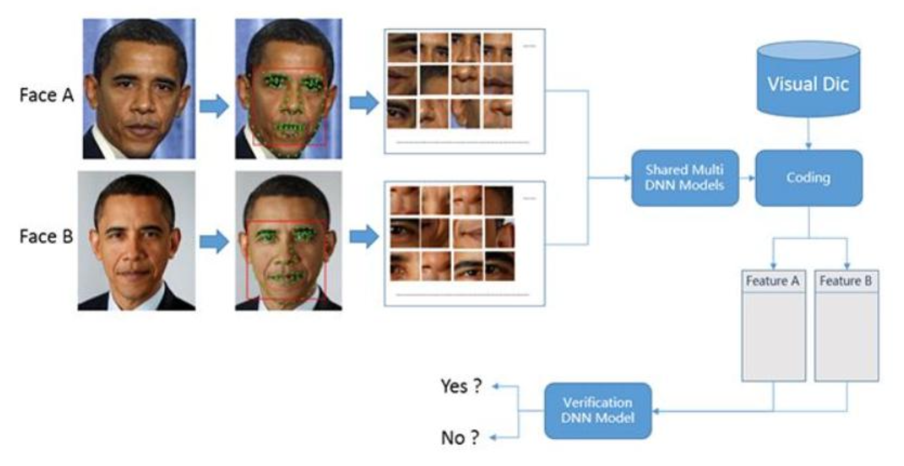
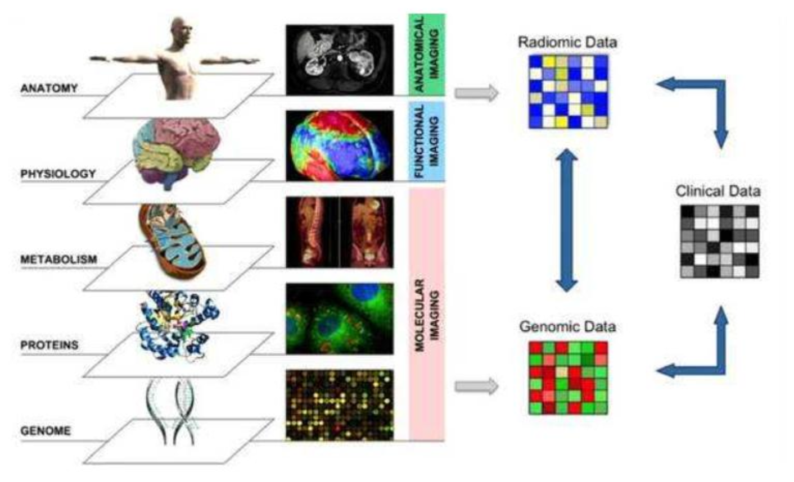
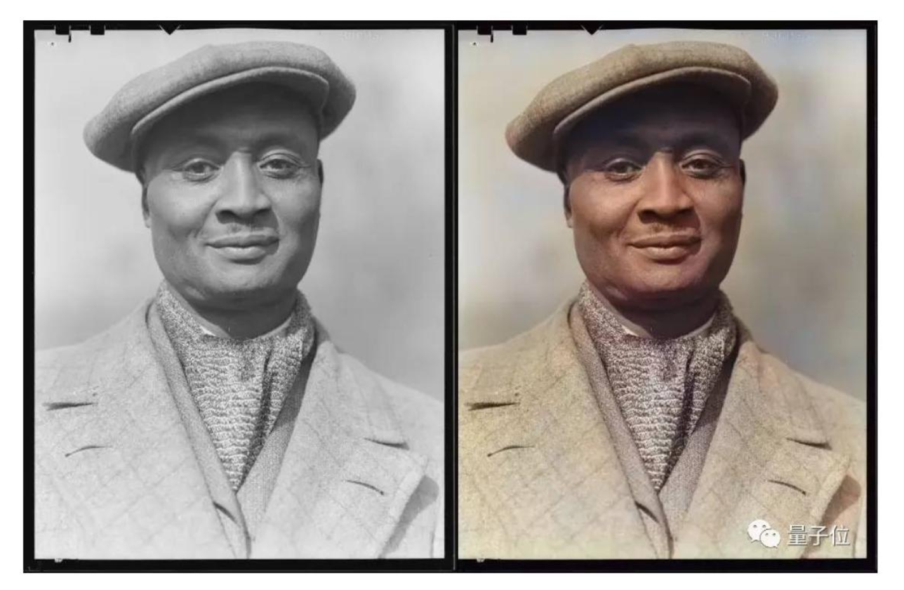
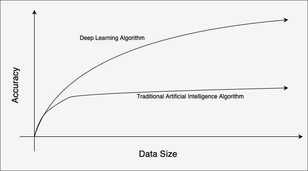
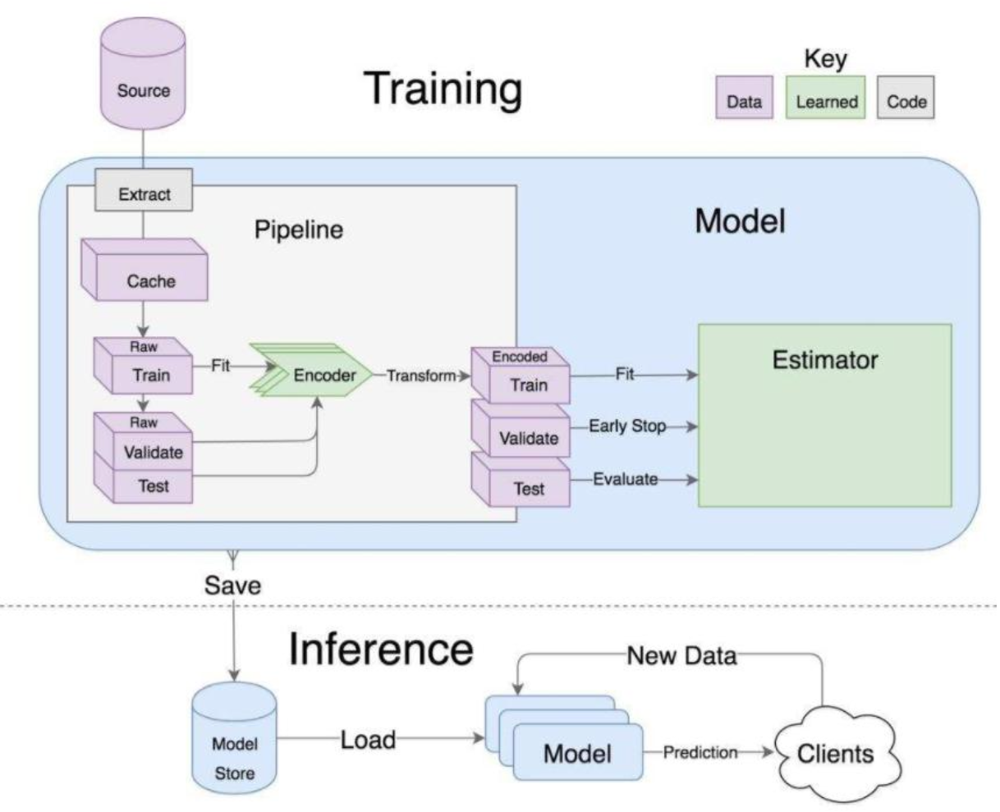
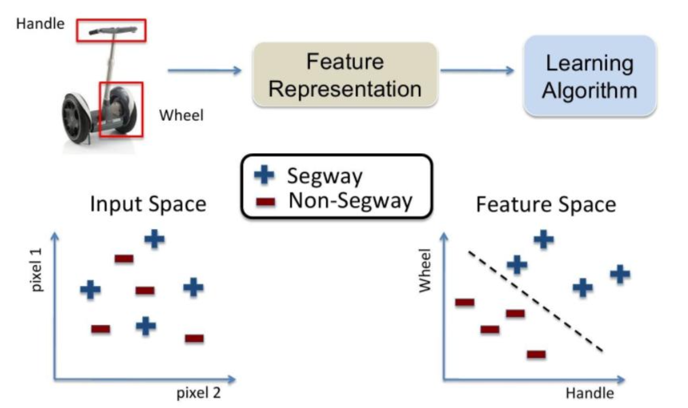
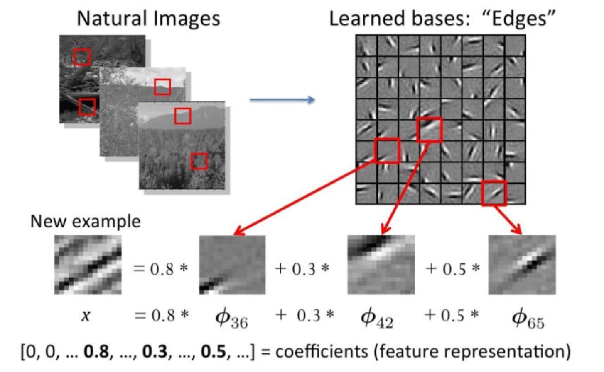

# Deep Learning Introduction

## Applications of Deep Learning

## Traditional Artificial Intelligence Algorithm v.s Deep Learning Algorithm

## Machine Learning Procedures

### 1. Data Collection

### 2. Feature Engineering

- Data features determine the upper bound of the model
- Preprocessing and feature extraction are the core
- Algorithm and parameter selection determine how to approach this upper limit

#### Methodology of Features Extraction

#### Traditional Methodology of Features Extraction

### 3. Model Building

### 4. Evaluation and Application
